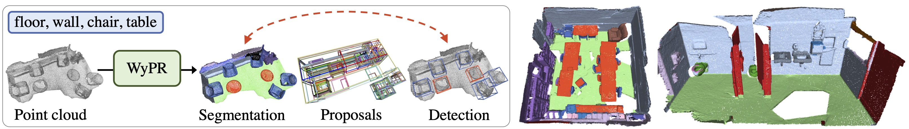

# Weakly-supervised Point Cloud Recognition (WyPR)

This repository contains PyTorch implementation of WyPR, as described in the paper [3D Spatial Recognition without Spatially Labeled 3D, Ren et al., CVPR 2021](https://arxiv.org/abs/2105.06461).

 

WyPR is a Weakly-supervised framework for Point cloud Recognition, requiring only scene-level class tags as supervision. 
WyPR jointly addresses three core 3D recognition tasks: point-level semantic segmentation, 3D proposal generation, and 3D object detection, 
coupling their predictions through self and cross-task consistency losses. 
In conjunction with standard multiple-instance learning (MIL) and self-training objectives, 
WyPR can detect and segment objects in point cloud without access to any spatial labels at training time. 
WyPR is evaluated on ScanNet and S3DIS datasets, and outperforms prior state of the art weakly-supervised works by a great margin.

### [Project](https://facebookresearch.github.io/WyPR) | [Paper](https://arxiv.org/abs/2105.06461) | [Slides](https://facebookresearch.github.io/WyPR/files/wypr_talk.pdf) | [Video](https://facebookresearch.github.io/WyPR/files/cvpr-talk.mp4) | [Blog](https://ai.facebook.com/blog/recognizing-3d-spaces-without-spatial-labels)

## Installation
Please follow the instructions in [docs/INSTALL.md](docs/INSTALL.md).

## Datasets
Please follow the `wypr/dataset/*/README.md` for downloading and pre-processing datasets.

## Runnning
Please check [docs/RUNNING.md](docs/RUNNING.md) for detailed running instructions and pre-trained models.

## Citation
If you find our work useful in your research, please consider citing:
```BibTeX
@inproceedings{ren2021wypr,
  title = {3D Spatial Recognition without Spatially Labeled 3D},
  author = {Ren, Zhongzheng and Misra, Ishan and Schwing, Alexander G. and Girdhar, Rohit},
  booktitle = {IEEE/CVF Conference on Computer Vision and Pattern Recognition (CVPR)},
  year = {2021}
}
```
## License
See the [LICENSE](LICENSE) for more details.

## Issues & Help
For help or issues using WyPR, please submit a GitHub issue or a PR request.

Before you do this, make sure you have checked [CODE_OF_CONDUCT](docs/.github/CODE_OF_CONDUCT.md), [CONTRIBUTING](docs/.github/CONTRIBUTING.md), [ISSUE_TEMPLATE](docs/.github/ISSUE_TEMPLATE.md), and [PR_TEMPLATE](docs/.github/PR_TEMPLATE.md).

## Acknowledgements
We thank the authors for releasing [Pointnet2_PyTorch](https://github.com/erikwijmans/Pointnet2_PyTorch), [VoteNet](https://github.com/facebookresearch/votenet), [PointContrast](https://github.com/facebookresearch/PointContrast), [MinkowskiEngine](https://github.com/NVIDIA/MinkowskiEngine), and [detectron2](https://github.com/facebookresearch/detectron2).
